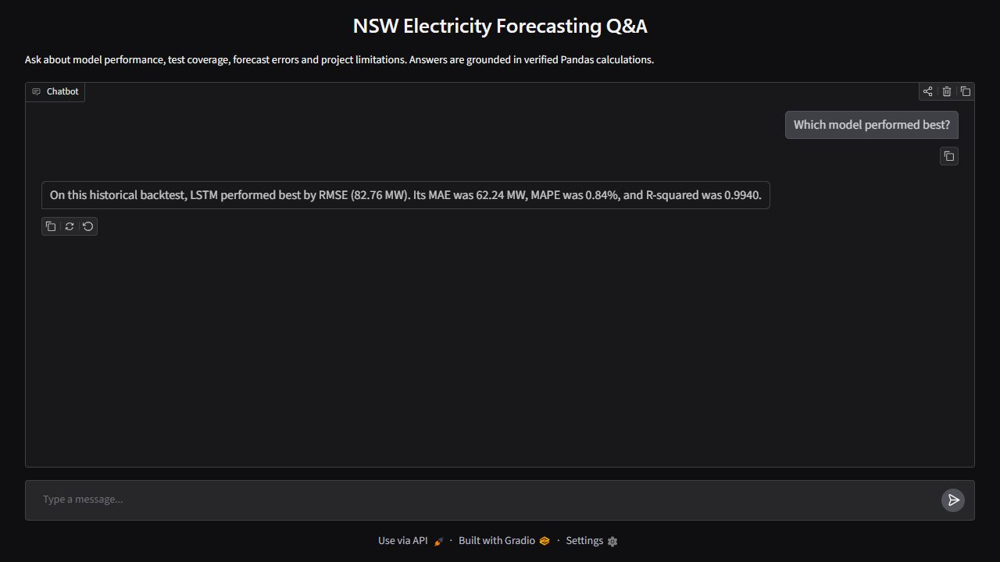
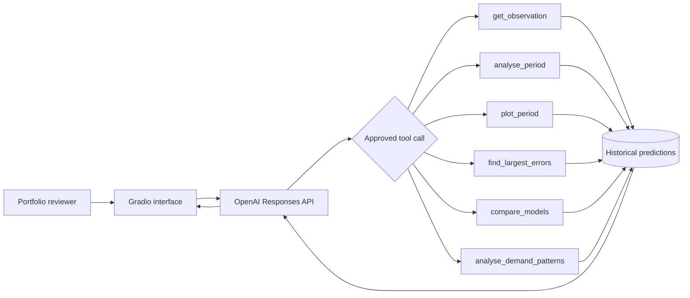
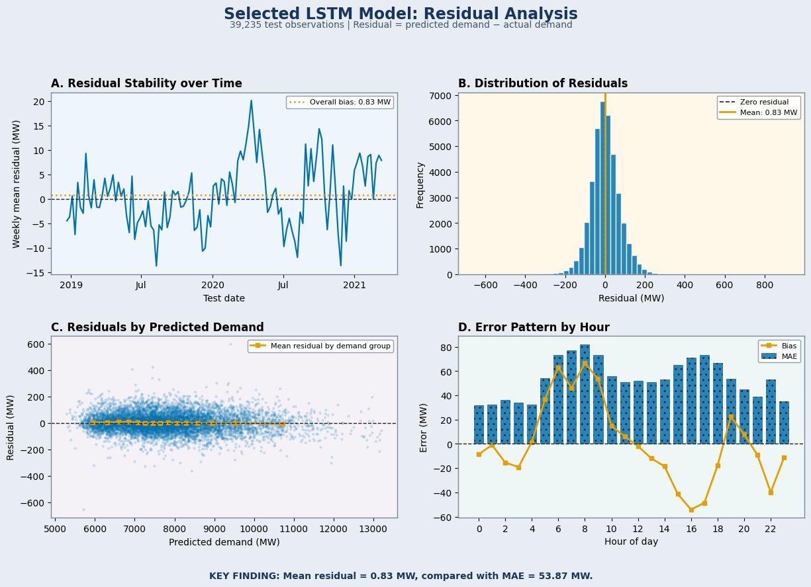

# NSW Electricity Demand Forecasting

### Forecasting with a persistence baseline, XGBoost and a Hyperband-tuned LSTM, plus a grounded GenAI analyst

Electricity demand changes quickly with time of day, recent consumption and weather. In this project, I built an end-to-end forecasting workflow for half-hourly electricity demand in New South Wales and compared three approaches on the same chronological test period.

The **LSTM was the strongest model**, achieving an MAE of **53.87 MW**, an RMSE of **71.55 MW**, a MAPE of **0.70%** and an R² of **0.9967** across **39,235 common test observations**. It reduced RMSE by approximately **14.4%** compared with XGBoost.


## Portfolio notebook with grounded GenAI analysis

[Electricity_Forecasting_GenAI_Analyst_Enhanced.ipynb](Electricity_Forecasting_GenAI_Analyst_Enhanced.ipynb)
is the recommended starting point for reviewers. It downloads a public 90-day prediction sample
from this repository, validates the timestamps and model outputs, recalculates
the evaluation metrics and launches an interactive Gradio analyst. It does not
request Google Drive access in its default public-demo configuration.

The language model does not calculate metrics or execute arbitrary Python.
Instead, it selects from six allow-listed analytical functions. Pandas performs
the requested calculations against the loaded prediction table, Plotly creates
charts, and the model explains the verified results. The complete prediction
table is not sent to the OpenAI API.

### Launch the temporary Gradio demo

1. Open [Electricity_Forecasting_GenAI_Analyst_Enhanced.ipynb](Electricity_Forecasting_GenAI_Analyst_Enhanced.ipynb)
   in Google Colab.
2. Run the cells in order.
3. Add a Colab secret named `OPENAI_API_KEY` and grant the notebook access. Do
   not paste the key into a cell, output, screenshot or GitHub file.
4. Run the final Gradio cell and open the generated `gradio.live` link.
5. Keep the Colab runtime running while demonstrating the app. Start the cell
   again whenever a fresh temporary link is needed.

This is the intended interview workflow: Colab supplies the temporary demo link,
so no additional deployment setup is required.



Strong demonstration questions include:

- Plot actual demand and all model outputs for any five random consecutive days.
- Compare LSTM, XGBoost and the persistence baseline over the full loaded period.
- Show the five largest LSTM forecasting errors.
- Analyse average demand by hour of day and chart it.
- Which weekday has the highest average demand?
- What happened at the timestamp containing the largest XGBoost error?
- Summarise the modelling results and limitations for a hiring manager.

## How the grounded analyst works

With the full private artifact, the notebook can work over the complete
**39,235-row common test period**; the public GitHub fallback uses a compact
90-day sample. The approved functions are:

- `get_observation` — retrieves an exact or nearest timestamp and calculates
  each model's error.
- `analyse_period` — calculates demand statistics and model metrics for a date
  range.
- `plot_period` — plots actual demand and every model output for a requested or
  reproducible random period.
- `find_largest_errors` — identifies the largest absolute forecasting errors.
- `compare_models` — ranks selected models using MAE, RMSE, MAPE and R².
- `analyse_demand_patterns` — analyses and charts demand by hour, weekday or
  month.

The OpenAI Responses API chooses which approved function to call and explains
its JSON result. It cannot execute arbitrary code and is instructed to describe
the outputs as a historical backtest rather than a live forecast. Chart requests
are returned to a separate Gradio plot panel.



## Why I built this

Short-term demand forecasts support electricity-market operations, capacity planning and system reliability. The task becomes especially interesting during extreme heat, when cooling demand increases but very hot observations are relatively scarce.

This portfolio project focuses on five questions:

1. How much value do machine-learning models add over a simple persistence forecast?
2. Can XGBoost capture demand using lagged, calendar and temperature features?
3. Does an LSTM benefit from learning directly from the previous 48 half-hourly observations?
4. Where does the selected model still make errors, particularly during very hot conditions?
5. Can a grounded GenAI layer explain verified forecasting results in natural language?

## Results

All metrics below were recalculated after joining the three saved prediction files by `DATETIME`. This ensures that every model is evaluated on exactly the same 39,235 observations.

| Model | Observations | MAE (MW) | RMSE (MW) | MAPE | R² |
|---|---:|---:|---:|---:|---:|
| **LSTM** | **39,235** | **53.87** | **71.55** | **0.70%** | **0.9967** |
| XGBoost | 39,235 | 61.14 | 83.63 | 0.79% | 0.9955 |
| Persistence baseline | 39,235 | 168.52 | 214.74 | 2.13% | 0.9706 |

The LSTM reduced:

- MAE by **11.9%** and RMSE by **14.4%** compared with XGBoost.
- MAE by **68.0%** and RMSE by **66.7%** compared with the persistence baseline.

The model comparison and two-day forecast view tell the same story: XGBoost performs well, but the LSTM follows the timing and magnitude of demand more closely. The persistence baseline visibly lags rapid changes.


## Modelling workflow

```text
Raw demand, forecast and temperature data
                    |
                    v
        Cleaning and timestamp alignment
                    |
                    v
       EDA and time-series diagnostics
                    |
                    v
     Chronological 70% / 10% / 20% split
                    |
                    v
   Baseline ------ XGBoost ------ LSTM
                    |
                    v
    Join predictions on common timestamps
                    |
                    v
 Model comparison, residuals and heat analysis
```

### Data preparation

The modelling table combines:

- NSW total electricity demand in MW.
- AEMO pre-dispatch demand forecasts.
- Temperature observations from Bankstown Airport.
- Calendar and time-derived fields.

The data is sorted chronologically and saved as Parquet for efficient reuse. Temperature is aligned to the closest available timestamp. The prepared portfolio dataset covers **January 2010 to March 2021** at half-hourly frequency.

`FORECASTDEMAND` is retained for external comparison only. It is deliberately excluded from the XGBoost and LSTM predictors to avoid duplicating another forecast inside the models.

### Exploratory data analysis

The EDA investigates:

- Demand patterns by hour, day and month.
- Weekday and weekend behaviour.
- The nonlinear relationship between demand and temperature.
- Daily seasonality and autocorrelation across 48 half-hourly periods.
- Demand behaviour during high-temperature conditions.

### Persistence baseline

Three simple forecasts are compared on the validation partition:

- Demand from the previous half hour.
- Demand at the same time on the previous day.
- Demand at the same time in the previous week.

The best validation model is the **previous-half-hour persistence baseline**. It establishes a realistic minimum benchmark for the trained models.

### XGBoost

The XGBoost model uses features designed specifically for tabular forecasting:

- Demand lags covering the previous 48 half hours, two days and one week.
- Shifted rolling means and standard deviations.
- Lagged temperature, temperature change and nonlinear temperature terms.
- Hour, day of week, month and weekend indicators.
- Cyclical sine/cosine encodings for calendar variables.

Early stopping is performed on the validation partition. No test observations are used for feature selection, tuning or stopping decisions.

### LSTM

The LSTM receives a sequence containing the previous **48 half-hourly observations**, representing one complete day of recent history. Each timestep includes historical demand, temperature, nonlinear temperature terms, rolling demand statistics and calendar information.

Input and target scalers are fitted on training data only. A sequence-alignment check confirms that the latest demand value supplied to the network is exactly `t-1`, while the target is demand at `t`.

Keras Hyperband searches the following validation-controlled hyperparameters:

- First and second LSTM-layer units.
- Dropout rate.
- L2 regularisation.
- Adam learning rate.

The test partition remains untouched until the tuned architecture is trained and evaluated.

## Selected model: LSTM

The LSTM was selected because it achieved the lowest MAE, RMSE and MAPE and the highest R² on the common test period. Its average residual was only **0.83 MW**, which is small relative to its MAE of 53.87 MW.

Residuals are generally centred near zero, although the hourly analysis identifies recurring overprediction and underprediction around parts of the daily demand cycle. This is useful operationally: a strong aggregate score does not mean the model is equally accurate at every hour.



## Performance during very hot conditions

Electricity demand generally rises during very hot conditions. Both the LSTM and AEMO forecast follow the average demand-temperature pattern, with the LSTM usually slightly closer to actual demand.

Temperatures above 40°C occur infrequently in Sydney. Predictions at the extreme end should therefore be interpreted cautiously because the model has fewer representative observations from which to learn.


## Repository structure

```text
NSW-Electricity-Demand-Forecasting/
|
|-- Electricity_Forecasting_GenAI_Analyst_Enhanced.ipynb
|-- Electricity_Forecasting_Portfolio.ipynb
|
|-- notebooks/
|   |-- 01 Data Prep.ipynb
|   |-- 02 EDA.ipynb
|   |-- 03 Feature Creation.ipynb
|   |-- 04 Baseline Final.ipynb
|   |-- 05 XGBoost.ipynb
|   |-- 06 LSTM.ipynb
|   `-- 07 Model Comparison.ipynb
|
|-- results/
|   |-- model_comparison.csv
|   |-- demo_predictions.parquet
|   `-- figures/
|       |-- 01_model_performance_comparison.png
|       |-- 02_actual_vs_predicted_all_models.png
|       |-- 03_lstm_residual_analysis.png
|       |-- 04_demand_during_very_hot_conditions.png
|       `-- 07_genai_gradio_preview.png
|
|-- scripts/
|   `-- export_demo_predictions.py
|
|-- README.md
|-- requirements.txt
|-- requirements-training.txt
`-- .gitignore
```

## Running the project

The notebooks are designed for Google Colab. The LSTM notebook should be run with a GPU runtime. Install the complete modelling environment with `requirements-training.txt`; `requirements.txt` contains only the lightweight Gradio notebook dependencies.

For the portfolio demonstration, open
`Electricity_Forecasting_GenAI_Analyst_Enhanced.ipynb` and run the cells in
order. The public sample works without Google Drive. Set
`USE_GOOGLE_DRIVE = True` only when you want to use your own full prediction
file. Add `OPENAI_API_KEY` through Colab Secrets; never store a key in the
notebook or repository. The final cell creates the temporary Gradio link used
for the interview demonstration.

`Electricity_Forecasting_Portfolio.ipynb` remains as the lightweight portfolio
analysis notebook. The enhanced notebook is the primary interactive GenAI demo.

1. Create the following folders in Google Drive:

   ```text
   NSW_Electricity_Demand/
   |-- Data/
   |   |-- Raw/
   |   `-- Processed/
   `-- Model Outputs/
   ```

2. Add the raw CSV files to `Data/Raw/`.
3. Run the notebooks in numerical order.
4. Use **Runtime > Change runtime type > GPU** before running the LSTM notebook.
5. The comparison notebook loads saved predictions; it does not retrain the models.

### Create the public notebook sample

The Colab portfolio notebook can use a compact 90-day sample of the final common
test period when the full Google Drive file is unavailable. If notebook 07 has
already created `common_test_predictions.parquet`, run:

```bash
python scripts/export_demo_predictions.py \
  --comparison "/path/to/common_test_predictions.parquet"
```

Alternatively, create the same output directly from the three model prediction
files:

```bash
python scripts/export_demo_predictions.py \
  --baseline "/path/to/baseline_predictions.parquet" \
  --xgboost "/path/to/xgboost_predictions.parquet" \
  --lstm "/path/to/lstm_predictions.parquet"
```

The exporter verifies unique timestamps, matching actual-demand values, finite
predictions and full-test metrics before writing
`results/demo_predictions.parquet`. The public file contains only timestamps,
actual demand, the three model predictions and the selected baseline name.

The principal training packages are:

```text
pandas
numpy
matplotlib
seaborn
scikit-learn
xgboost
tensorflow
keras-tuner
pyarrow
joblib
```

## Data sources

- Electricity demand and pre-dispatch forecast data: [Australian Energy Market Operator - NEM data](https://www.aemo.com.au/energy-systems/electricity/national-electricity-market-nem/data-nem).
- Historical weather observations: [Australian Bureau of Meteorology - Climate Data Online](https://www.bom.gov.au/climate/data/index.shtml).
- Temperature location: Bankstown Airport AWS, station 066137.

Raw data is not included in this repository because of file size and source-data conditions. The data-preparation notebook documents the expected filenames and processing steps.

## Limitations and future work

- Bankstown Airport temperature is used as a proxy for weather across NSW.
- Extreme-temperature observations are scarce, increasing uncertainty above 40°C.
- Rooftop solar generation is not included directly, despite its influence on grid demand.
- The project evaluates one-step, 30-minute-ahead forecasting rather than longer horizons.
- Additional weather variables such as humidity, apparent temperature and heatwave duration may improve extreme-demand forecasts.

Future work could add more years of extreme-weather data, multiple weather stations, rooftop solar generation, probabilistic prediction intervals and a hybrid model that treats historical sequences and known future calendar features separately.

## About this portfolio version

This repository is an independent work I originally explored as part of a university group capstone project.

For this portfolio version, I independently built the data preparation, exploratory data analysis, persistence baseline, XGBoost model, LSTM sequence model, Hyperband tuning, common-timestamp evaluation, residual analysis and final visualisations. The original group report addressed a broader research problem; the notebooks, experiments and results presented here were recreated for this individual portfolio.

## Tools

Python · Pandas · NumPy · Matplotlib · Seaborn · Scikit-learn · XGBoost · TensorFlow/Keras · Keras Tuner · Gradio · OpenAI Responses API · Google Colab · Git

